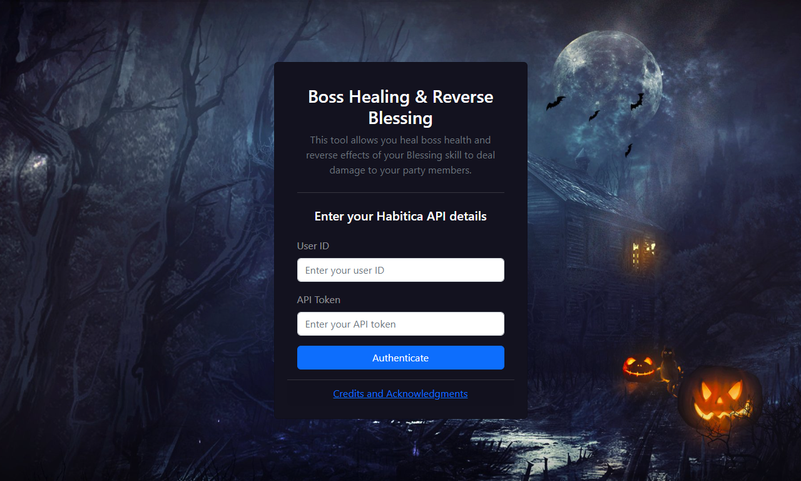

<div align="center">
  
</div>
<h1 align="center">Boss Healing and Reverse Blessing</h1>
<p align="center">
    <a href="https://boss-healing-reverse-blessing.vercel.app/" target="_blank">Boss Healing & Reverse Blessing</a> is a web app extension for <a href="https://habitica.com/" target="_blank">Habitica</a> that allows a user to add health to a quest boss and deal damage to party members.
</p>




## 💬 About the project

This application enables the user to reverse the effects of completed tasks or Blessing spells by setting their buffs to negative values. It works on the principle that certain negative Character Stats will reverse their effects on the player and their party.

Boss Healing reverses the user's Strength by setting it to a negative number. Completing a task will then deal negative damage, which adds health to the party's quest boss, healing it and potentially adding health beyond its maximum HP.

Reverse Blessing reverses the user's Constitution by setting it to a negative number. Casting the Blessing skill will provide negative healing, thereby causing damage to your party members.

## 🛠 Installation Guide

1. Clone the project
    ```
    git clone https://github.com/jonathanBenedito/habitica-boss-healer-reverse-blessing.git
    ```

2. Access the repository
    ```
    cd habitica-boss-healer-reverse-blessing
    ```

3. Install the project package
    ```
    npm install
    ```

4. Start the app
    ```
    npm start
    ```

## 🧱 Technologies

- React JS
- React Bootstrap
- React Router
- Javascript
- CSS

## 🔗 Links

Website: <a href="https://boss-healing-reverse-blessing.vercel.app/">boss-healing-reverse-blessing.vercel.app</a>
<br />
Wiki page: <a href="https://habitica.fandom.com/wiki/Boss_Healing_and_Reverse_Blessing" target="_blank">habitica.fandom.com/wiki/Boss_Healing_and_Reverse_Blessing</a>
<br />
Habitica: <a href="https://habitica.com/">habitica.com</a>
<br />
Habitica API: <a href="https://habitica.com/apidoc/">habitica.com/apidoc</a>
<br />